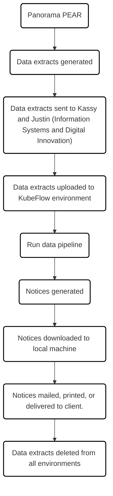

# 🩺 Immunization Charts

## 📘 Introduction

This project provides a Python-based workflow for generating personalized immunization history charts and notice letters for children who are overdue for mandated vaccinations under the **Immunization of School Pupils Act (ISPA)** or the **Child Care and Early Years Act (CCEYA)**. Reports are generated in PDF format using [Typst](https://typst.app) and a custom report template.

---

## ⚙️ Usage

### Environment 
This project is written in **Python** and uses [Typst](https://typst.app) for typesetting. All dependencies are managed via a `pyproject.toml` file. 

### Data
This project is intended to be used with data extracts from [Panorama PEAR](https://accessonehealth.ca/).

Input files, in `xlsx` format should be organized in a subfolder `input` (out of caution, input and output folders are `.gitignore`d, and need to be recreated by the user). Each `xlsx` file should be a single sheet with the following columns:
- `Language`
- `School`
- `Client ID`
- `First Name`
- `Last Name`
- `Date of Birth`
- `Street Address`
- `City`
- `Province`
- `Postal Code`
- `Vaccines Due`
- `Received Agents`

In case of large cohorts, it may be helpful to have `xlsx` exports from Panorama PEAR batched by client birth year. 

`Language` should be set to either `French` or `English` for each client.

`Received Agents` is a string representation of the immunization history. To create this immunization history string, a "Repeater" Data Container must be used in the Panorama PEAR report builder. The repeater will be formatted as:
1. `[PresentationView].[Immunization Received].[Date Administered]`
2. Text box with space, dash, and a space (` - `)
3. `[PresentationView].[Immunization Received].[Immunizing Agent]`

### Functionality 
To be added... 

### Data Pipeline Overview

